# Deploying and Managing Microservices on AWS EKS with Kubernetes: A Comprehensive Guide

## Project Overview

The goal of this project is to deploy and manage a microservices-based application using Kubernetes, leveraging AWS as the cloud provider. This project demonstrates how to provision an Elastic Kubernetes Service (EKS) cluster, deploy application components as pods within a dedicated namespace (`sock-shop`), expose the frontend to the internet using Kubernetes Ingress, and set up a robust monitoring solution with Grafana, Prometheus, and Alertmanager. Additionally, the project aims to secure the application using a Let's Encrypt SSL certificate, ensuring that all communications are encrypted. The overarching objective is to showcase a scalable, production-ready infrastructure capable of hosting microservices in a cloud environment.

## Prerequisites

To get started with this project, you'll need to have the following tools installed on your local machine:

- **Terraform**: Used to provision and manage the EKS cluster and related AWS infrastructure.
- **AWS CLI**: Required for interacting with AWS services from your command line.
- **kubectl**: The Kubernetes command-line tool used for deploying and managing applications on your EKS cluster.
- **Helm**: A package manager for Kubernetes, used to install and manage Kubernetes applications such as Grafana and Prometheus.

### Setup Instructions:

1. **Install Terraform**:  
   Follow the official [Terraform installation guide](https://developer.hashicorp.com/terraform/tutorials/aws-get-started/install-cli) to install Terraform on your system.

2. **Install AWS CLI**:  
   Install the AWS Command Line Interface by following the [AWS CLI installation guide](https://docs.aws.amazon.com/cli/latest/userguide/install-cliv2.html). After installation, configure your AWS credentials using the command `aws configure`.

3. **Install kubectl**:  
   To manage your Kubernetes cluster, install `kubectl` by following the [kubectl installation guide](https://kubernetes.io/docs/tasks/tools/install-kubectl/). Ensure it is configured to communicate with your EKS cluster.

4. **Install Helm**:  
   Helm simplifies managing Kubernetes applications. Install Helm by following the [Helm installation guide](https://helm.sh/docs/intro/install/).

### 1. Infrastructure Setup

To provision the EKS cluster on AWS using Terraform, follow these steps:

**Environment Setup**:  
  Begin by setting your AWS credentials (Access Key ID and Secret Access Key) as environment variables in your terminal. This allows Terraform to authenticate and interact with your AWS account.

- Add your AWS Access Key ID

  ```bash
  export AWS_ACCESS_KEY_ID=your_access_key_id`
  ```

- Add your AWS Secret Access Key

  ```bash
  export AWS_SECRET_ACCESS_KEY=your_secret_access_key`
  ```

**Writing Terraform Files**:  
  Create the necessary Terraform files to define and manage my infrastructure:

  - `main.tf`: Contains all the essential resources to set up the EKS cluster, including VPC, EKS itself, node groups, and any other required components.

  - `backend.tf`: Used to configure the backend for Terraform state management. In this case, the state file will be stored in an S3 bucket to enable collaboration and track changes.

**Provisioning Resources**:

- Once the Terraform files are ready, run the following commands:

  ```bash
  terraform init
  ```

  Initializes the Terraform configuration, downloading necessary providers and setting up the backend.

  ```bash
  terraform plan
  ```

  Creates an execution plan, allowing you to review the changes that will be made to the infrastructure.

  ```bash
  terraform apply --auto-approve
  ```

  Applies the changes and provisions the EKS cluster and associated resources automatically without requiring further confirmation. 
  
  This takes about 12 ~ 15 minutes, and Successful provisioning of the EKS cluster will look like this:

  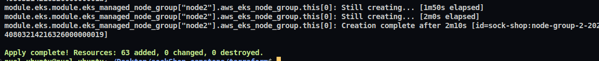

### 2. Kubernetes Configurations

After provisioning the EKS cluster, the next step is to set up the Kubernetes environment for deploying the microservices:

**Creating and Configuring the `sock-shop` Namespace**:

- First, create the `sock-shop` namespace where all the microservices will be deployed. Use the following command:

  ```bash
  kubectl create namespace sock-shop
  ```

  - Next, update your kubeconfig to connect to the EKS cluster (also named sock-shop) and set the current context to the newly created namespace:

  ```bash
  aws eks update-kubeconfig --region <your-region> --name <cluster-name>
  kubectl config set-context --current --namespace=<your-namespace>
  ```

  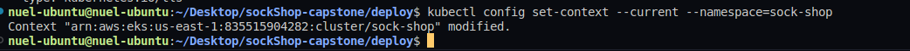

  This will make subsequent commands to run on the specified namespace unless stated otherwise.

- **Deployment Files**:
  In a project like this, where the deployment configuration file can be very lengthy, it's best to split it into separate files for each service being provisioned. This approach makes it easier to debug issues and identify any faulty pods.

  Each service should have its own YAML file, containing the necessary configurations such as deployments, services, and other Kubernetes resources.

  This structure helps maintain clarity and manageability as the number of services and configurations grows.

  Refer to the  directory for the YAML configuration files.

**Deploy Kubernetes resources**:

- After the cluster has been provisioned, deploy the services cnfiguration files:

  ```bash
  kubectl apply -f ./deploy/.
  ```

- Confirm if the pods are running, and their current state:

  ```bash
  kubectl get pods
  ```

  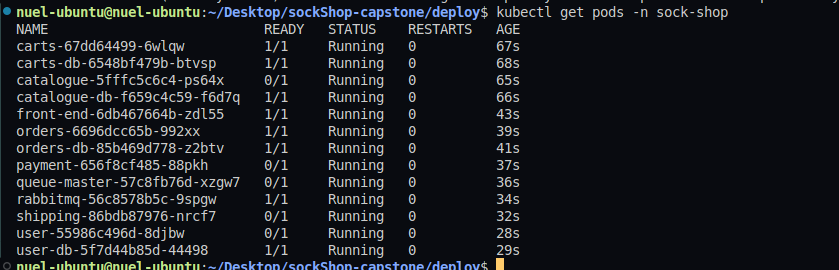

  - The pods deployed in the cluster serve as containers for the services in configuration files. To confirm the services are running, run the following command:

  ```bash
  kubectl get svc
  ```

  .png)

### 3. Ingress Configuration

To expose the frontend of the microservices application to the internet, follow these steps:

**Add the NGINX Ingress Helm Repository**:

- First, add the official NGINX Ingress Helm chart repository:

  ```bash
  helm repo add ingress-nginx https://kubernetes.github.io/ingress-nginx
  helm repo update
  ```

**Install the NGINX Ingress Controller - Exposing the Frontend Service**:

- Install the NGINX Ingress Controller in your cluster

  ```bash
  helm install ingress-nginx ingress-nginx/ingress-nginx
  ```

- Create an ingress.yaml file to define the routing rules for your frontend service, and apply it to your cluster:

  ```bash
  kubectl apply -f ingress.yaml
  ```

  This creates a load balancer on AWS

  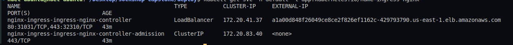

- Update AWS Hosted Zone:
  
  Map the necessary DNS record in your AWS Hosted Zone to point to the load balancer created by the Ingress Controller.

  This typically involves updating the A or CNAME record for your domain/subdomain.

  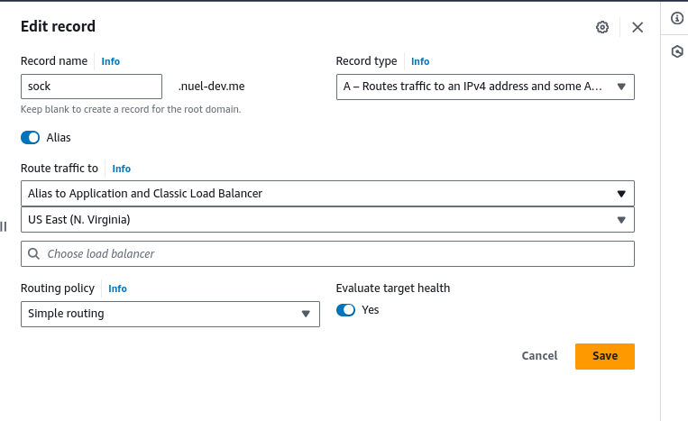

- Confirm Accessibility:
Verify that your application is accessible via the browser by visiting the mapped domain. You should see your frontend being served properly.

  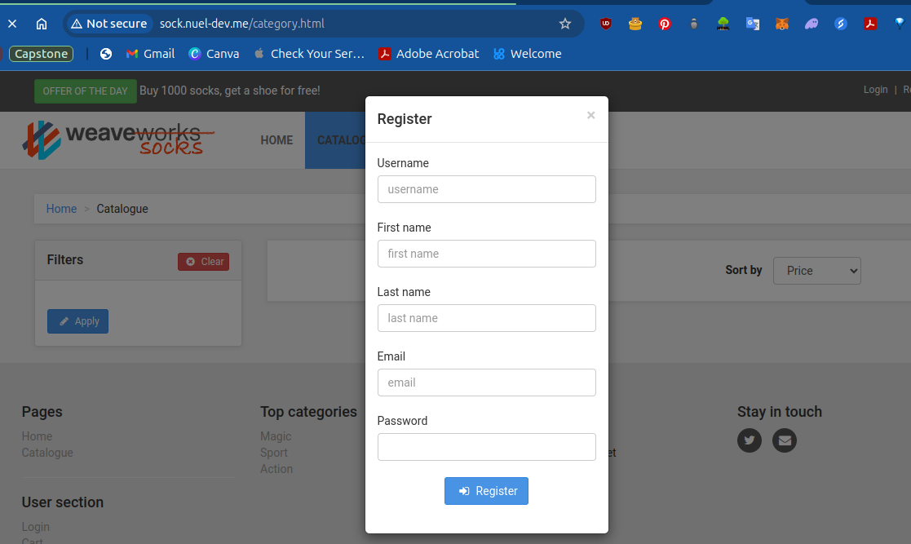

### 4. Monitoring Setup

To set up monitoring for your Kubernetes cluster and the deployed application, follow these steps:

  **Add the Helm Repository for kube-prometheus-stack**:
  
- Start by adding the Helm repository that contains the kube-prometheus-stack:

  ```bash
  helm repo add prometheus-community https://prometheus-community.github.io/helm-charts
  helm repo update
  ```

  **Install Prometheus, Grafana, and Alertmanager**:

- Install the kube-prometheus-stack, which includes Prometheus, Grafana, and Alertmanager, into your Kubernetes cluster:

  ```bash
  helm install prometheus prometheus-community/kube-prometheus-stack
  ```

  Get the services names and port numbers for prometheus services installed

  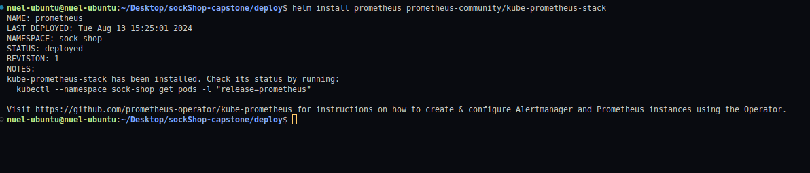
  
  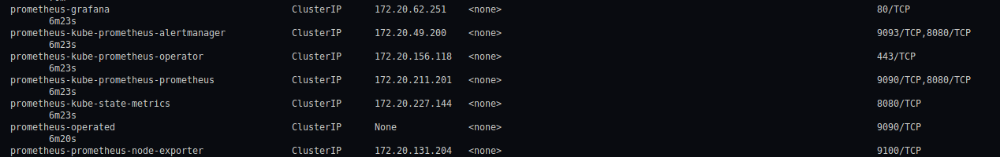

- Update ingress.yaml to include hosts and port numbers for the prometheus and grafana services.

  ```yaml
  - host: grafana.nuel-dev.me
    http:
      paths:
      - path: /
        pathType: Prefix
        backend:
          service:
            name: prometheus-grafana
            port:
              number: 80          

  - host: prometheus.nuel-dev.me
    http:
      paths:
      - path: /
        pathType: Prefix
        backend:
          service:
            name: prometheus-kube-prometheus-prometheus
            port:
              number: 9090
  ```

- Just like with the frontend service, update the Hosted Zone records for `grafana.<domain>` and `prometheus.<domain>` to point to the load balancer.

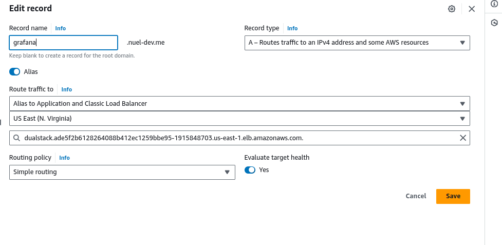

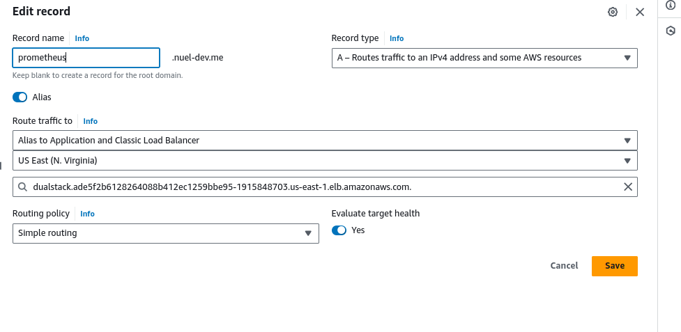

  **Accessing Grafana**:

  Retrieve the Grafana admin password and access the Grafana dashboard:

  ```bash
  kubectl get secret prometheus-grafana -o jsonpath="{.data.admin-password}" | base64 --decode
  ```

  Visit http://grafana.<domain> in your browser and log in using the username admin and the retrieved password.

  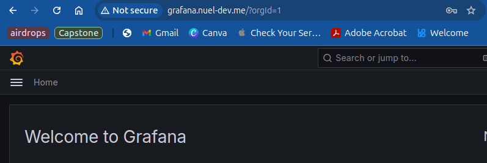

  **Set Up Dashboards and Alerts**:

- On Grafana, navigate to Connections > Data Source > Add Data Source. Select Prometheus. This allows Grafana to get metrics from Prometheus and represent them visually.

  Leave the name as default, then add the prometheus url to the configuration page

  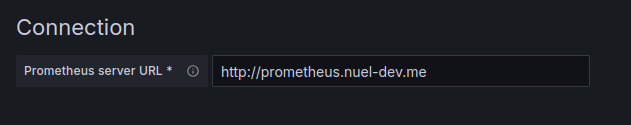

- Import pre-built dashboards or create custom ones in Grafana to visualize the metrics collected by Prometheus. This is done with either a JSON file or an ID

  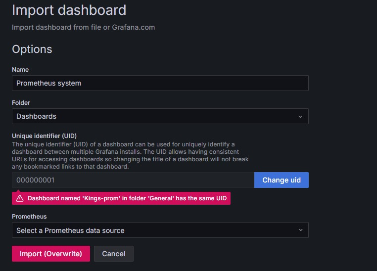

  This is a sample dashboard created with the  I used:

  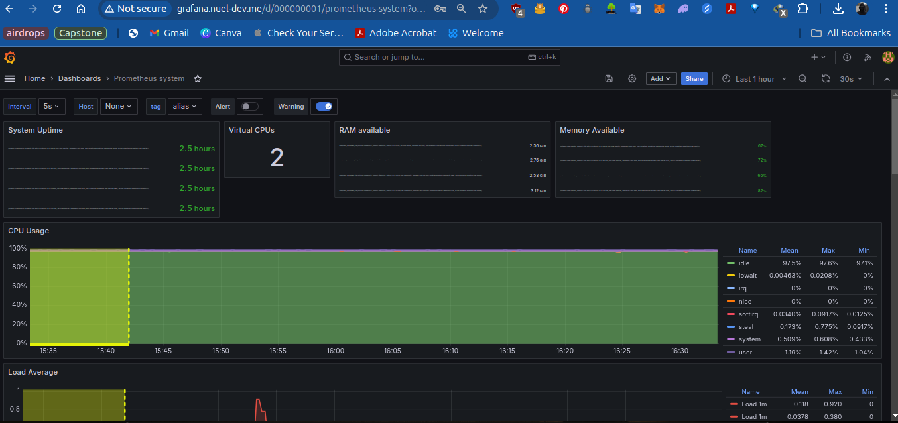

  Another example using a custom ID:

  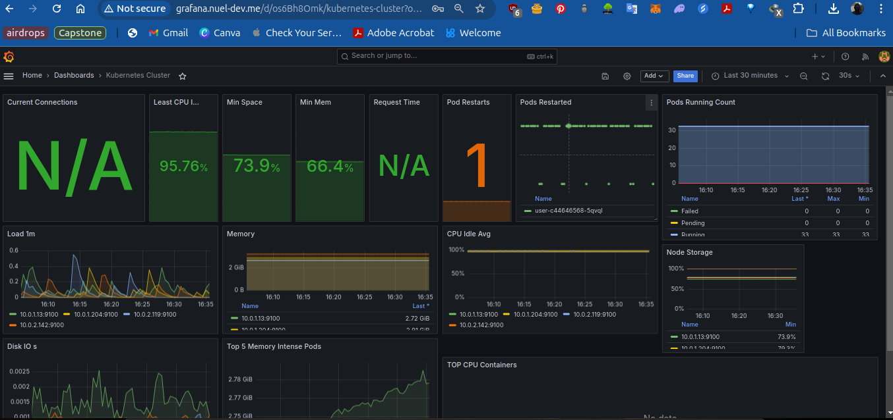

### 5. CI/CD Setup with GitHub Actions

To automate the deployment process for this project, two GitHub Actions workflows were created:

#### 1. Terraform Workflow

This workflow (`terraform.yml`) is responsible for provisioning the necessary AWS resources, including the EKS cluster and other infrastructure components, using Terraform.

**Workflow Trigger**: 
- The workflow runs on every push to the `terraform` branch or when manually triggered via the `workflow_dispatch` event.

**Key Steps**:
- **Checkout Code**: Pulls the latest code from the repository.
- **Set up Terraform**: Installs Terraform to manage infrastructure as code.
- **Set up kubectl & Helm**: Installs kubectl and Helm for Kubernetes cluster management.
- **Configure AWS Credentials**: Sets up AWS credentials using GitHub Secrets for secure access to AWS.
- **Create S3 Bucket**: Creates an S3 bucket to store the Terraform state file.
- **Create EKS Cluster**: Initializes and applies the Terraform configuration to provision the EKS cluster and other resources.
- **Update kubeconfig**: Updates the Kubernetes configuration to interact with the new EKS cluster.
- **Add Helm Repositories**: Adds necessary Helm repositories for NGINX Ingress, Prometheus, and Cert-Manager.

#### 2. Kubernetes Workflow

This workflow (`k8s.yml`) deploys the Kubernetes resources, such as pods, services, and Helm charts, to the EKS cluster.

**Workflow Trigger**: 
- The workflow runs on every push to the `main` branch or when manually triggered via the `workflow_dispatch` event.

**Key Steps**:
- **Checkout Code**: Pulls the latest code from the repository.
- **Configure AWS Credentials**: Sets up AWS credentials using GitHub Secrets for secure access to AWS.
- **Set up kubectl & Helm**: Installs kubectl and Helm for Kubernetes cluster management.
- **Update kubeconfig**: Updates the Kubernetes configuration to interact with the `sock-shop` namespace in the EKS cluster.
- **Add Helm Repositories**: Adds necessary Helm repositories for NGINX Ingress, Prometheus, and Cert-Manager.
- **Install Helm Charts**: Installs or upgrades Helm charts for NGINX Ingress and the Prometheus monitoring stack.
- **Run Deployment Files**: Applies the Kubernetes YAML files in the `deploy/` directory to deploy the application and services.

These workflows ensure a streamlined and automated deployment process, allowing for efficient infrastructure provisioning and application deployment directly from GitHub. This setup not only speeds up the deployment process but also enforces consistency and repeatability in the environment, reducing the likelihood of errors.

### Conclusion

This project demonstrates the full lifecycle of deploying a microservices application on AWS using Kubernetes. By leveraging Terraform for infrastructure as code, we efficiently provisioned an EKS cluster and configured it to host a scalable and resilient application. Through the use of Kubernetes Ingress, we exposed the application to the internet, ensuring seamless access for users. The integration of Prometheus, Grafana, and Alertmanager provided a robust monitoring solution, enabling real-time insights into the application's performance and health.

While the implementation of Let's Encrypt for SSL certification is still pending, this setup lays the foundation for a production-ready environment that can be expanded and secured as needed. This project showcases the power and flexibility of cloud-native technologies in managing modern applications and highlights best practices for deploying, monitoring, and scaling microservices in the cloud.

With this foundation in place, the next steps could involve optimizing resource usage, automating CI/CD pipelines, and enhancing security measures to ensure the application remains performant and secure in a real-world environment.